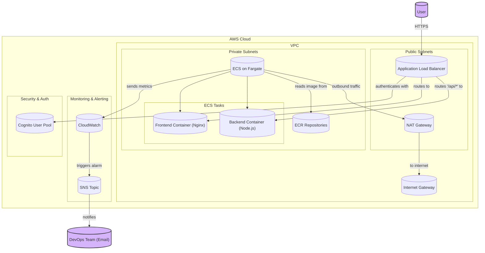

# Infrastructure Diagram

This diagram illustrates the cloud architecture for the internal dashboard application, created using Mermaid.js.

```mermaid
graph TD
    subgraph "AWS Cloud"
        subgraph "VPC"
            subgraph "Public Subnets"
                ALB[("Application Load Balancer")]
                NAT[("NAT Gateway")]
            end

            subgraph "Private Subnets"
                ECS_Fargate[("ECS on Fargate")] -- reads image from --> ECR[("ECR Repositories")]
                subgraph "ECS Tasks"
                    Frontend_Task[("Frontend Container (Nginx)")]
                    Backend_Task[("Backend Container (Node.js)")]
                end
                ECS_Fargate --> Frontend_Task
                ECS_Fargate --> Backend_Task
            end

            IGW[("Internet Gateway")]
            ALB -- routes to --> Frontend_Task
            ALB -- routes '/api/*' to --> Backend_Task
            ECS_Fargate -- outbound traffic --> NAT
            NAT -- to internet --> IGW
        end

        subgraph "Monitoring & Alerting"
            CloudWatch[("CloudWatch")] -- triggers alarm --> SNS[("SNS Topic")]
            ECS_Fargate -- sends metrics --> CloudWatch
        end

        subgraph "Security & Auth"
            Cognito[("Cognito User Pool")]
        end

    end

    User[("User")] -- HTTPS --> ALB
    ALB -- authenticates with --> Cognito
    SNS -- notifies --> DevOps_Team[("DevOps Team (Email)")]

    style User fill:#d6b4fc,stroke:#333,stroke-width:2px
    style DevOps_Team fill:#d6b4fc,stroke:#333,stroke-width:2px
```
